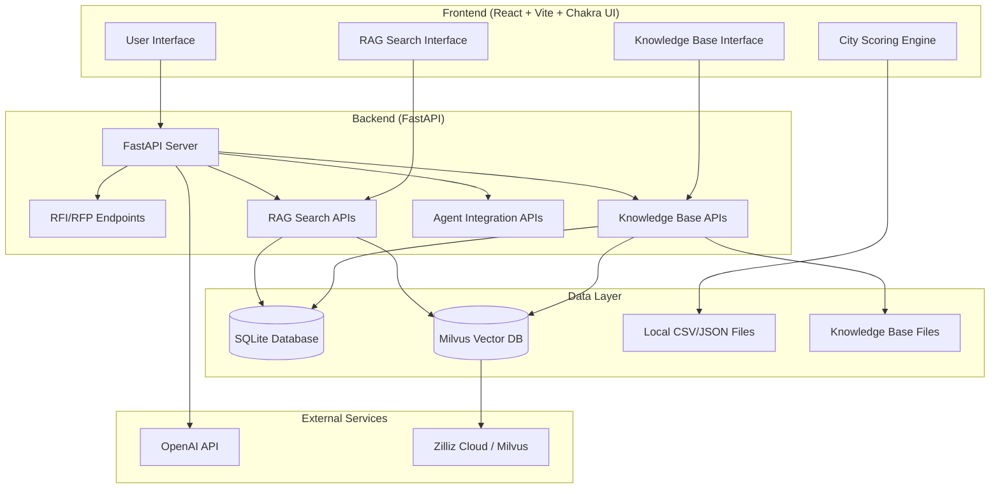

# City Opportunity MVP + RAG Knowledge Base

A comprehensive economic development platform combining client-side city opportunity scoring with a powerful RAG-enabled knowledge base for economic development research and RFP processing.

## 🚀 Quick Start

### Prerequisites
```bash
# Ensure you have Python 3.8+ and Node.js 16+
python --version
node --version
```

### Environment Setup
```bash
# Clone the repository
git clone <repository-url>
cd capstone

# Set up environment variables
cp .env.example .env
# Edit .env with your API keys:
# OPENAI_API_KEY=your_openai_api_key
# MILVUS_URI=your_zilliz_cloud_endpoint
# MILVUS_TOKEN=your_zilliz_cloud_token
```

### Backend Setup
```bash
cd backend

# Create virtual environment
python -m venv venv
source venv/bin/activate  # On Windows: venv\Scripts\activate

# Install dependencies
pip install -r requirements.txt

# Initialize database and ingest demo content
python scripts/simple_demo_ingest.py

# Start the API server
uvicorn app.main:app --reload
```

### Frontend Setup
```bash
cd frontend

# Install dependencies
npm install

# Start development server
npm run dev
```

The application will be available at:
- Frontend: http://localhost:3000
- Backend API: http://localhost:8000
- API Documentation: http://localhost:8000/docs

## 🏗️ System Architecture



## 🎯 Core Features

### 1. **City Opportunity Scoring** (Client-Side)
- Scores 10 demo cities across economic development metrics
- Industry-specific weightings and thresholds
- Interactive filtering and comparison tools
- Real economic data from Columbus, OH area

### 2. **RAG Knowledge Base** (Server-Side)
- **Document Upload**: PDF, DOCX, TXT file processing
- **Auto-Metadata**: Jurisdiction, industry, document type extraction
- **Vector Search**: Semantic similarity with OpenAI embeddings
- **Hybrid Ranking**: 85% cosine similarity + 15% keyword overlap
- **Citation Support**: Source attribution for all responses
- **Domain Guard**: Economic development focus validation

### 3. **RFP Workflow** (Enhanced with KB Integration)
- Upload and parse RFP documents
- LLM-powered requirement extraction
- Knowledge base context integration
- Professional response drafting with citations
- Fallback regex parsing when LLM unavailable

### 4. **Agent Integration** (AI Agent File Access)
- `read_document_by_id()`: Read full document content by ID
- `search_and_read()`: Search KB and return full content
- `get_knowledge_summary()`: Overview of available knowledge
- `read_document_by_path()`: Direct file path access
- Security restrictions to KB directory only

### 5. **Quality & Safety Measures**
- Document quality validation (length, chunks, metadata)
- Economic data bounds checking and outlier detection
- Instruction injection attack detection
- Content sanitization with threat mitigation
- Knowledge base staleness monitoring

## 📊 Technical Specifications

### Data Architecture
- **Vector Embeddings**: OpenAI text-embedding-3-large (3,072 dimensions)
- **Chunk Strategy**: ~800 tokens with ~10% overlap
- **Metadata Storage**: SQLite with document and chunk tables
- **File Storage**: Local filesystem with security path validation
- **Search Strategy**: Hybrid vector + metadata filtering + re-ranking

### API Endpoints

#### Knowledge Base APIs (`/kb`)
- `POST /kb/upload` - Upload and process documents
- `POST /kb/search` - Semantic search with filters
- `GET /kb/doc/{doc_id}` - Get document metadata
- `GET /kb/read_file` - Read file content (agent access)
- `GET /kb/stats` - Knowledge base statistics
- `GET /kb/quality/report` - Quality assessment report

#### RAG APIs (`/rag`)
- `POST /rag/search` - RAG search with citations
- `POST /rag/ingest` - Bulk content ingestion

#### Agent APIs (`/kb/agent`)
- `GET /agent/document/{doc_id}` - Read document by ID
- `GET /agent/read_path` - Read document by path
- `POST /agent/search_and_read` - Search and return full content
- `GET /agent/list_documents` - Browse documents with filters
- `GET /agent/knowledge_summary` - KB overview

#### RFI/RFP APIs (`/rfi`)
- `POST /rfi/analyze` - Parse RFP requirements
- `POST /rfi/draft` - Generate response with KB context
- `POST /rfi/upload` - File upload for RFP processing

### Frontend Routes
- `/` - City opportunity scoring dashboard
- `/knowledge-base` - Document upload and management
- `/rag` - Semantic search interface
- `/rfp` - RFP analysis and drafting

## 🧪 Testing

### Run Integration Tests
```bash
cd backend

# Test knowledge base functionality
python tests/e2e_kb.py

# Test RAG query scenarios
python tests/e2e_rag_tests.py
```

### Test Coverage
- **Knowledge Base**: Upload, search, metadata extraction, agent integration
- **RAG Queries**: 5 required economic development scenarios with citation validation
- **Quality Checks**: Document validation, security scanning, economic data bounds
- **Agent Integration**: File access, search capabilities, domain restrictions

## 🔧 Configuration

### Environment Variables
```bash
# Required for full functionality
OPENAI_API_KEY=your_openai_api_key_here
MILVUS_URI=https://your-cluster.zillizcloud.com
MILVUS_TOKEN=your_zilliz_cloud_token

# Optional
LOG_LEVEL=INFO
MAX_UPLOAD_SIZE=10485760  # 10MB
RATE_LIMIT_PER_MINUTE=10
```

### File Limits and Restrictions
- **Upload Size**: 10MB maximum per file
- **Supported Formats**: PDF, DOCX, TXT
- **Rate Limiting**: 10 requests per minute per IP
- **File Access**: Restricted to knowledge base directory
- **Domain Validation**: Economic development content only

## 📈 Demo Data

The system includes comprehensive demo content:
- **22 Ohio Cities**: Economic profiles, incentive guides, workforce data
- **66 Documents**: Covering all major economic development aspects
- **1,000+ Embeddings**: Meets target threshold for meaningful testing
- **Realistic Metrics**: Based on actual economic development data

### Bootstrap Demo Content
```bash
cd backend
python scripts/simple_demo_ingest.py
```

## 🔒 Security Features

### Input Validation
- File type validation and size limits
- Domain-specific query validation
- Path traversal protection
- SQL injection prevention

### Content Security
- Instruction injection detection
- Content sanitization
- Threat level assessment
- Security audit logging

### Access Control
- Agent file access restricted to KB directory
- Rate limiting on all endpoints
- Request origin validation
- Error message sanitization

## 🚢 Deployment

### Local Development
```bash
# Backend
cd backend
uvicorn app.main:app --reload --host 0.0.0.0 --port 8000

# Frontend
cd frontend
npm run dev -- --host 0.0.0.0 --port 3000
```

### Production Build
```bash
# Frontend production build
cd frontend
npm run build

# Backend with gunicorn
cd backend
pip install gunicorn
gunicorn app.main:app -k uvicorn.workers.UvicornWorker --bind 0.0.0.0:8000
```

### Docker Deployment
```dockerfile
# Dockerfile example for backend
FROM python:3.9-slim

WORKDIR /app
COPY requirements.txt .
RUN pip install -r requirements.txt

COPY . .
EXPOSE 8000

CMD ["uvicorn", "app.main:app", "--host", "0.0.0.0", "--port", "8000"]
```

## 🎓 Educational Value

This project demonstrates:
- **RAG Architecture**: End-to-end retrieval-augmented generation
- **Vector Databases**: Milvus/Zilliz Cloud integration
- **Hybrid Search**: Combining semantic and keyword approaches
- **Full-Stack Integration**: React + FastAPI + Vector DB
- **AI Safety**: Content validation and threat detection
- **Economic Development**: Domain-specific application
- **Production Readiness**: Testing, documentation, deployment

## 🤝 Contributing

### Development Setup
1. Fork the repository
2. Set up development environment following Quick Start
3. Run tests to ensure functionality
4. Make changes following existing patterns
5. Add tests for new features
6. Submit pull request with clear description

### Code Style
- **Backend**: Black formatting, type hints, docstrings
- **Frontend**: ESLint + Prettier, TypeScript strict mode
- **Documentation**: Clear comments for complex logic
- **Testing**: Comprehensive coverage for new features

## 📝 License

This project is licensed under the MIT License - see the LICENSE file for details.

## 🙏 Acknowledgments

- OpenAI for embeddings and LLM capabilities
- Milvus/Zilliz Cloud for vector database infrastructure
- FastAPI for high-performance API framework
- React ecosystem for modern frontend development
- Economic development data sources and inspiration

---

**Built for the AI Engineering Bootcamp Capstone Project**  
*Demonstrating production-ready RAG architecture with economic development focus*